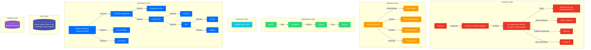

```mermaid
graph TB
	subgraph Frontend[Frontend Layer]
		Browser:::frontend -->|Requests| HTMX[HTMX for Dynamic Updates]:::frontend
		HTMX -->|Renders| UI[UI Components: Articles, Quizzes, Code Snippets]:::frontend
		UI -->|Styles| Styles[Tailwind CSS with Monospaced Fonts]:::frontend
		UI -->|Math Rendering| Math[KaTeX / MathJax]:::frontend
		UI -->|Graphics Rendering| Mermaid[Mermaid]:::frontend
		UI -->|Quiz Interactions| Quiz[Vanilla JS]:::frontend
	end

	subgraph Backend[Backend Layer]
		Framework[Flask Application]:::backend -->|Authenticates| Authenticator[Flask-Login]:::backend
		Framework -->|Queries| ORM[Flask-SQLAlchemy]:::backend
		Framework -->|Handles| Console[Admin Interface]:::backend
		Framework -->|Searches| Searcher[Search Engine]:::backend
	end

	subgraph Deployment[Deployment Layer]
		Domain[bpu.im]:::deployment -->|DNS| Proxy[Cloudflare]:::deployment
		Proxy -->|Proxies| Hosting[Netcup]:::deployment
		Hosting -->|Runs| Server[Apache]:::deployment
	end

	subgraph Execution[Execution Layer]
		Runner[Judge0 / glot.io API]:::execution
	end

	subgraph Conversion[Conversion Layer]
		Markdown[Python-Markdown Article/Quiz/Code]:::conversion -->|Converts| Converter[Converter Application]:::conversion
		Markdown -->|Prepares| Code[Execute Block]:::conversion
		Markdown -->|Prepares| Test[Test Block]:::conversion
		Converter -->|Embeds| Asymptote[Asymptote HTML]:::conversion
		Converter -->|Embeds| LaTeX[LaTeX SVG]:::conversion
		LaTeX -->|Renders| chemfig:::conversion
		LaTeX -->|Renders| TikZ:::conversion
		TikZ -->|Renders| tkz-tab:::conversion
		TikZ -->|Renders| pgfplots:::conversion
	end

	subgraph Data[Data Layer]
		Database[(SQLite: Article Paths, User Credentials, Quiz Progress)]:::data
	end

	subgraph Storage[Storage Layer]
		Articles[(Markdown Articles)]:::storage
	end

	linkStyle default background:#c7c3bd
	classDef frontend fill:#ed3524,stroke:white,color:white
	classDef backend fill:#fa9d01,stroke:white,color:white
	classDef deployment fill:#2eda77,stroke:white,color:white
	classDef execution fill:#14c7de,stroke:white,color:white
	classDef conversion fill:#016fff,stroke:white,color:white
	classDef data fill:#444fad,stroke:white,color:white
	classDef storage fill:#8c54d0,stroke:white,color:white
```