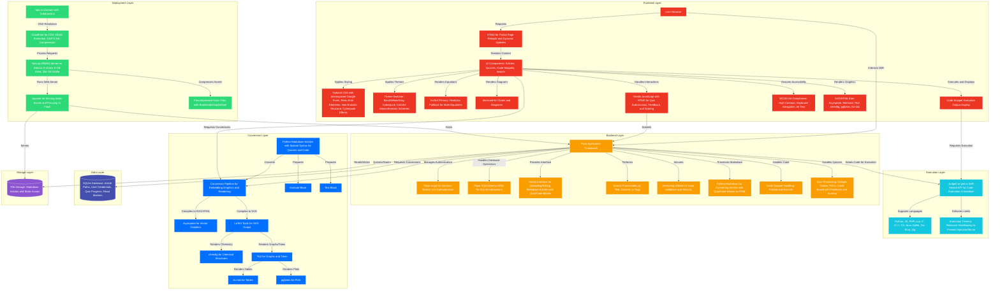

```mermaid
graph TB
	subgraph Frontend[Frontend Layer]
		Browser[User Browser]:::frontend -->|Requests| HTMX[HTMX for Partial Page Reloads and Dynamic Updates]:::frontend
		HTMX -->|Renders Content| UI[UI Components: Articles, Quizzes, Code Snippets, Search]:::frontend
		UI -->|Applies Styling| Styles[Tailwind CSS with Monospaced Google Fonts, Retro 8-bit Elements, Neo-Brutalist Structure, Cyberpunk Effects]:::frontend
		UI -->|Applies Themes| Themes[Theme Switcher: Black/White/Gray, Cyberpunk, Colorful Monochromatic Schemes]:::frontend
		UI -->|Renders Equations| Math[KaTeX Primary / MathJax Fallback for Math Equations]:::frontend
		UI -->|Renders Diagrams| Mermaid[Mermaid for Charts and Diagrams]:::frontend
		UI -->|Handles Interactions| Quiz[Vanilla JavaScript with HTMX for Quiz Submissions, Feedback, and Scoring]:::frontend
		UI -->|Executes and Displays| CodeDisplay[Code Snippet Execution Output Display]:::frontend
		UI -->|Ensures Accessibility| Accessibility[WCAG AA Compliance: High Contrast, Keyboard Navigation, Alt Text]:::frontend
		UI -->|Renders Graphics| Graphics[SVG/HTML from Asymptote, Mermaid, TikZ, chemfig, pgfplots, tkz-tab]:::frontend
	end

	subgraph Backend[Backend Layer]
		Framework[Flask Application Framework]:::backend -->|Manages Authentication| Authenticator[Flask-Login for Session-Based User Authentication]:::backend
		Framework -->|Handles Database Operations| ORM[Flask-SQLAlchemy ORM for SQLite Interactions]:::backend
		Framework -->|Provides Interface| Console[Admin Interface for Uploading/Editing Markdown Articles with Quiz/Code Blocks]:::backend
		Framework -->|Performs| Searcher[Search Functionality by Title, Content, or Tags]:::backend
		Framework -->|Secures| Security[Werkzeug Utilities for Input Validation and Security]:::backend
		Framework -->|Processes Markdown| MarkdownProcessor[Python-Markdown for Converting Articles with Quiz/Code Blocks to HTML]:::backend
		Framework -->|Handles Code| CodeHandler[Code Snippet Handling: Embed and Execute]:::backend
		Framework -->|Handles Quizzes| QuizHandler[Quiz Processing: Multiple-Choice, Fill-In, Code-Based with Feedback and Scoring]:::backend
	end

	subgraph Deployment[Deployment Layer]
		Domain[bpu.im Domain with Subdomains]:::deployment -->|DNS Resolution| Proxy[Cloudflare for CDN, DDoS Protection, CAPTCHA, Compression]:::deployment
		Proxy -->|Proxies Requests| Hosting[Netcup ARM64 Server on Debian: 6 vCore, 8 GB RAM, 256 GB NVMe]:::deployment
		Hosting -->|Runs Web Server| Server[Apache for Serving Static Assets and Proxying to Flask]:::deployment
		Hosting -->|Compresses Assets| Compression[Precompressed Static Files with Brotli/Zstd/Gzip/Deflate]:::deployment
	end

	subgraph Execution[Execution Layer]
		Runner[Judge0 or glot.io Self-Hosted API for Code Execution in Sandbox]:::execution
		Runner -->|Supports Languages| Languages[Python, JS, PHP, Lua, C, C++, C#, Java, Kotlin, Go, Rust, Zig]:::execution
		Runner -->|Enforces Limits| Limits[Execution Timeout, Resource Sandboxing to Prevent Injection/Abuse]:::execution
	end

	subgraph Conversion[Conversion Layer]
		Markdown[Python-Markdown Articles with Special Syntax for Quizzes and Code]:::conversion -->|Converts| Converter[Conversion Pipeline for Embedding Graphics and Rendering]:::conversion
		Markdown -->|Prepares| Code[Execute Block]:::conversion
		Markdown -->|Prepares| Test[Test Block]:::conversion
		Converter -->|Compiles to SVG/HTML| Asymptote[Asymptote for Vector Graphics]:::conversion
		Converter -->|Compiles to SVG| LaTeX[LaTeX Tools for SVG Output]:::conversion
		LaTeX -->|Renders Chemistry| chemfig[chemfig for Chemical Structures]:::conversion
		LaTeX -->|Renders Graphs/Trees| TikZ[TikZ for Graphs and Trees]:::conversion
		TikZ -->|Renders Tables| tkz-tab[tkz-tab for Tables]:::conversion
		TikZ -->|Renders Plots| pgfplots[pgfplots for Plots]:::conversion
	end

	subgraph Data[Data Layer]
		Database[(SQLite Database: Article Paths, User Credentials, Quiz Progress, Read Markers)]:::data
	end

	subgraph Storage[Storage Layer]
		Articles[(File Storage: Markdown Articles and Static Assets)]:::storage
	end

	Browser -->|Interacts With| Framework
	Framework -->|Queries/Stores| Database
	Framework -->|Reads/Writes| Articles
	Framework -->|Sends Code for Execution| Runner
	Framework -->|Requests Conversions| Converter
	UI -->|Requests Conversions| Converter
	Quiz -->|Submits| Framework
	CodeDisplay -->|Requests Execution| Runner
	Server -->|Hosts| Framework
	Server -->|Serves| Articles

	linkStyle default background:#c7c3bd
	classDef frontend fill:#ed3524,stroke:white,color:white
	classDef backend fill:#fa9d01,stroke:white,color:white
	classDef deployment fill:#2eda77,stroke:white,color:white
	classDef execution fill:#14c7de,stroke:white,color:white
	classDef conversion fill:#016fff,stroke:white,color:white
	classDef data fill:#444fad,stroke:white,color:white
	classDef storage fill:#8c54d0,stroke:white,color:white
```